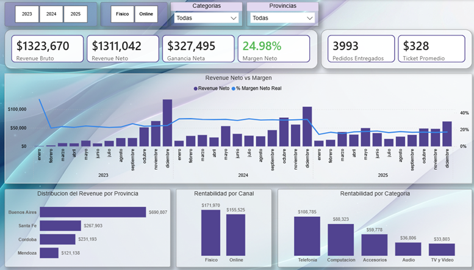
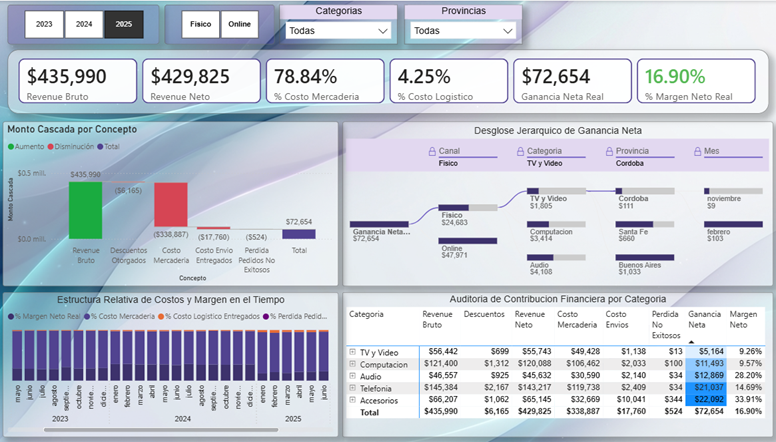
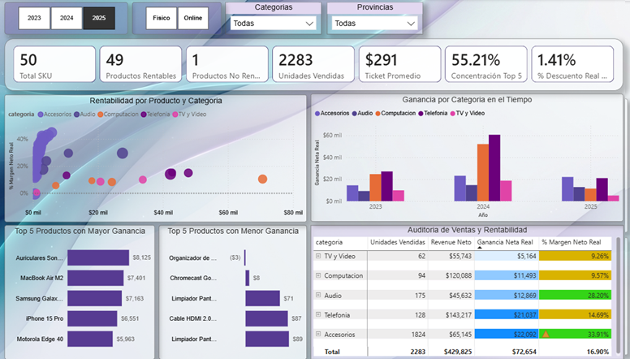
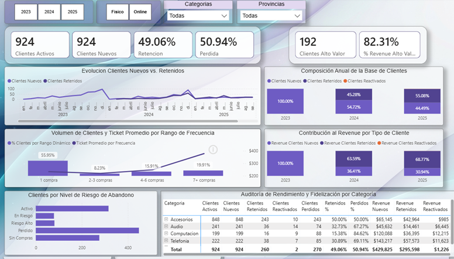

# 🛒 TechnoShop: End-to-End Retail Data Analytics

## 📋 Resumen Ejecutivo
Este proyecto es un análisis de datos completo para TechnoShop, un comercio de retail tecnológico multicanal. El objetivo principal fue diagnosticar la reciente caída estructural de rentabilidad (2023-2025) y entender el comportamiento de retención de clientes. 

A pesar de sostener el volumen de ventas (+3% interanual), el margen neto cayó severamente. A través de este pipeline de datos, se demostró que la causa no es una crisis de demanda, sino un incremento del **Costo de Mercadería** combinado con políticas logísticas ineficientes para productos de ticket bajo en el canal Online (el actual motor de crecimiento del negocio).

## 🛠️ Arquitectura y Stack Tecnológico
El proyecto abarca todo el ciclo de vida del dato, diseñado bajo un enfoque pragmático y orientado a resultados:

1. **Ingeniería de Datos (Python & Pandas):** Desarrollo de un pipeline ETL modular (`extract.py`, `inspect.py`, `clean.py`, `transform.py`, `load.py`). Se priorizó la velocidad de transformación y limpieza mediante Pandas, omitiendo validaciones estrictas de esquemas (schema validation) para acelerar el flujo de análisis y el cruce dimensional.
2. **Exploración y Validación (SQL):** Uso de SQLite para auditar las tablas dimensionales y de hechos (`dim_clientes`, `dim_productos`, `fact_pedidos_final`) antes de su ingesta visual.
3. **Business Intelligence (Power BI):** Modelado de datos y desarrollo de un dashboard analítico para la toma de decisiones gerenciales.

---

## 📊 Insights Clave de Negocio

### 1. La Paradoja de Rentabilidad y el Motor Online
Entre 2024 y 2025, el margen neto cayó del 33% al 21% (Físico) y del 30% al 15% (Online). Sin embargo, el canal Online generó **$47,971 de ganancia neta en 2025**, casi el doble que el canal Físico. Online se ha convertido indiscutiblemente en la fuente principal de crecimiento y volumen, aunque con un margen porcentual más ajustado que requiere optimización.

### 2. Causa Raíz: Inflación de Proveedores y Pisos de Envío
El % Costo de Mercadería (COGS) subió ~13 puntos (llegando al 78% del revenue). Los costos logísticos se mantuvieron marginales a nivel general, descartando crisis operativas. 
El hallazgo más crítico: **el mismo producto rinde distinto según el canal**. Un accesorio de $15 absorbe un costo fijo de envío de $10 en la web, destruyendo el margen (más del 50% de su valor), mientras que en una notebook de $1,600 el envío es insignificante. Esto genera márgenes negativos en productos económicos vendidos online de forma unitaria.

### 3. Salud del Catálogo: Alerta en Computación
La categoría *Computación* sufrió la peor combinación posible: perdió volumen y rentabilidad simultáneamente (de 135 pedidos a 27% de margen en 2024, a 77 pedidos y 9% de margen en 2025). El traslado de costos a precio final volvió productos clave (como MacBook Air) menos accesibles, comprimiendo el revenue. *Accesorios* tomó el liderazgo en ganancia gracias al volumen, aunque presenta alta variabilidad interna de márgenes.

### 4. Fuga de Clientes de Alto Valor
La concentración de ingresos supera el principio de Pareto: **el 20% de los clientes genera el 73% del revenue neto**. El riesgo principal radica en que, en 2025, la tasa de pérdida de clientes (50.94%) superó a la de retención. El segmento "Perdido" es ya el más numeroso de la base histórica. El desafío no es atraer, sino retener a los perfiles de alto valor.

---

## 💡 Acciones Estratégicas Recomendadas

* **Rediseñar Políticas de Envío Online:** Implementar mínimos de compra libre de envío o costos escalonados por ticket para evitar que productos económicos (accesorios, Chromecast) operen con margen negativo al venderse de forma unitaria.
* **Auditoría de Pricing en Computación:** Revisar urgente el traslado de precios al consumidor. La compresión de la MacBook Air indica que la estrategia actual de reprecio destruye volumen sin compensar en margen.
* **Depuración de la Categoría Accesorios:** Segmentar por margen individual. Potenciar los SKUs estrella y aplicar estrategias de *bundling* (combos), reprecio o descontinuación a los de peor desempeño.
* **Programa de Retención de Alto Valor:** Priorizar la retención sobre la adquisición. Diseñar acciones de fidelización dirigidas al segmento "En Riesgo", ya que la pérdida de un solo cliente del Top 20% impacta severamente en la rentabilidad general.
